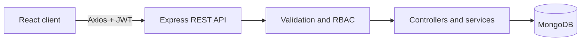
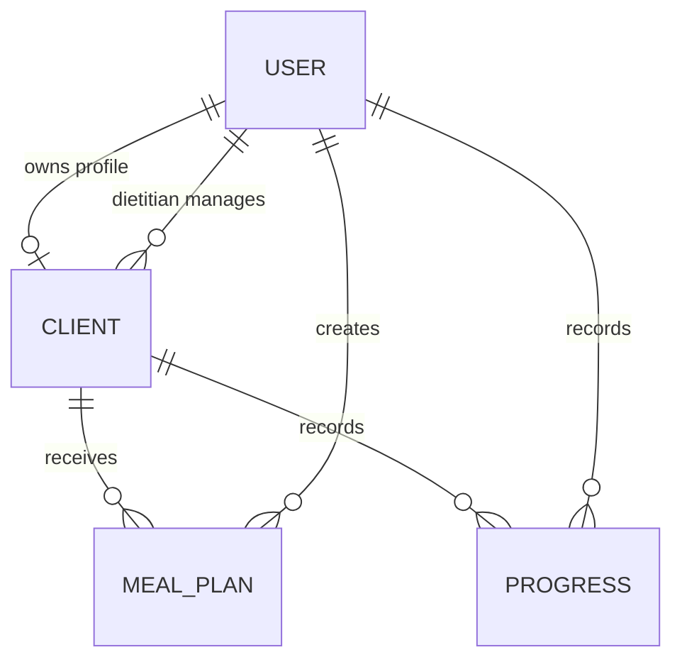

# System Architecture

## Overview

Nutrition Assistant follows a client-server architecture. React renders role-aware interfaces and communicates with Express through JSON REST APIs. Express validates requests, authenticates JWTs, applies authorization rules and uses Mongoose to persist documents in MongoDB.

## Backend pattern

The backend uses a controller-service-model variation of MVC:

- **Routes** map HTTP methods and paths.
- **Middleware** handles authentication, authorization, validation and errors.
- **Controllers** coordinate requests and responses.
- **Services** contain reusable access and nutrition calculations.
- **Models** define persistence rules and indexes.

## Data relationships

### User

Stores identity, role, approval status and authentication data. Roles are `user`, `dietitian` and `admin`.

### Client

Links exactly one wellness user to an optional dietitian. It stores body measurements, nutrition goal, calorie target, dietary preference, allergies and conditions.

### MealPlan

References a client and creator. It embeds meals and food items because those values are normally read and updated as one plan. A model hook calculates nutrient totals before validation.

### Progress

References a client and the user who recorded the entry. It contains time-series metrics and is indexed by client and date.

## Authorization matrix

| Capability | User | Dietitian | Admin |
| --- | ---: | ---: | ---: |
| View own profile/plans/progress | Yes | — | Yes |
| Log own progress | Yes | — | Yes |
| View assigned clients | — | Yes | Yes |
| Manage assigned clients | — | Yes | Yes |
| Create meal plans | — | Assigned clients | All clients |
| Approve dietitians | — | — | Yes |
| Manage roles/status | — | — | Yes |

## Request lifecycle

1. Axios sends a JWT in the `Authorization: Bearer` header.
2. Authentication middleware verifies the token and active account.
3. Role middleware checks route-level permission.
4. Zod validates request parameters and body.
5. Controller loads the referenced client.
6. Access service verifies ownership or dietitian assignment.
7. Mongoose applies model constraints and persists the operation.
8. Centralized error middleware returns a consistent response.

## Scalability decisions

- Client/date and client/status indexes optimize dashboards.
- Page-level lazy loading reduces the first JavaScript payload.
- Controllers are separated by feature for team development.
- Provider-independent REST interfaces allow future mobile clients.
- Aggregated analytics can later move to MongoDB pipelines or scheduled summaries without changing the UI contract.
